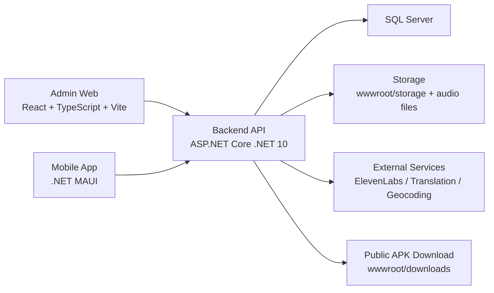

# Vinh Khanh Food

Monorepo cho đồ án hệ thống quản lý và trải nghiệm tham quan ẩm thực khu phố Vĩnh Khánh.

Repository này đang chứa đầy đủ 4 phần chính:

- `apps/admin-web`: web quản trị cho Super Admin và Chủ quán.
- `apps/backend-api`: ASP.NET Core API dùng chung cho admin web, mobile app và public bootstrap.
- `apps/mobile-app`: ứng dụng .NET MAUI cho người dùng cuối.
- `apps/core`: thư viện dùng chung cho contract mobile và logic fallback ngôn ngữ.

## 1. Mục tiêu hệ thống

Hệ thống phục vụ 2 nhóm người dùng:

- Nhóm vận hành nội bộ:
  - Super Admin quản lý toàn bộ POI, tour, ưu đãi, nội dung, media, audio, log, cài đặt và duyệt thay đổi POI.
  - Chủ quán chỉ được làm việc trong phạm vi quán/POI của mình.
- Nhóm người dùng cuối:
  - Xem POI trên bản đồ.
  - Xem chi tiết quán, món ăn, ưu đãi, tour.
  - Nghe audio thuyết minh đa ngôn ngữ.

## 2. Kiến trúc tổng thể



### Kiến trúc theo vai trò

- `admin-web` là lớp giao diện quản trị.
- `backend-api` là trung tâm xử lý nghiệp vụ, phân quyền, bootstrap dữ liệu, audio, localization và analytics.
- `SQL Server` là nơi lưu dữ liệu quản trị, POI, route, promotion, audit, app presence.
- `mobile-app` tiêu thụ bootstrap dữ liệu online và gửi ngược heartbeat, analytics, trạng thái sử dụng.
- `core` giữ contract và rule dùng chung để tránh lệch logic giữa backend và mobile.

## 3. Các module nghiệp vụ hiện có

- Quản lý POI, món ăn, media, audio guide.
- Quản lý tour tham quan.
- Quản lý ưu đãi với 2 trạng thái `upcoming` và `active`.
- Duyệt thay đổi POI do chủ quán gửi (`PoiChangeRequests`).
- Dashboard admin và thống kê online users từ mobile heartbeat.
- Bootstrap dữ liệu public/admin.
- Dịch runtime theo ngôn ngữ client.
- Tạo/gọi audio narration qua TTS và audio guide pregenerated.
- Đồng bộ analytics từ mobile.
- Theo dõi QR download APK public.

## 4. Luồng kiến trúc hiện tại

### 4.1. Luồng admin web

1. Admin hoặc Chủ quán đăng nhập qua `POST /api/v1/auth/login`.
2. Frontend lấy token và nạp bootstrap từ `GET /api/v1/bootstrap`.
3. Toàn bộ state quản trị được đưa vào `AdminDataProvider` trong `apps/admin-web/src/data/store.tsx`.
4. Các màn hình như POI, Tour, Ưu đãi, Media, Dashboard gọi API CRUD tương ứng.
5. Backend kiểm tra quyền bằng `AdminRequestContextResolver` trước khi ghi dữ liệu.

### 4.2. Luồng backend và dữ liệu

1. `Program.cs` đăng ký controller, storage, localization, narration, translation/TTS client.
2. `AdminDataRepository` là lớp truy cập dữ liệu trung tâm.
3. Repository dùng ADO.NET + SQL Server trực tiếp, không dùng EF Core.
4. Schema được kiểm tra/cập nhật theo pattern `Ensure...Schema()` trong repository, không dùng EF Migration.
5. `GetBootstrap()` trả dữ liệu tổng hợp cho admin hoặc public/mobile tùy ngữ cảnh.

### 4.3. Luồng mobile app

1. App khởi động từ `App.xaml.cs`, nạp ngôn ngữ và khởi tạo cache SQLite cục bộ.
2. `MauiProgram.cs` đăng ký các service chính: data service, app presence, audio playback, route/tour state.
3. App lấy dữ liệu từ backend theo ngôn ngữ đang chọn.
4. Khi app foreground, `AppPresenceService` gửi heartbeat định kỳ.
5. Khi app background/stop, app cố gửi offline event và dừng heartbeat.
6. Mobile chạy online-first và dùng cache SQLite cục bộ làm fallback khi cần.

### 4.4. Luồng localization

1. Backend chỉ lưu nội dung gốc cho entity chính.
2. `BootstrapLocalizationService` tự dịch runtime khi public/mobile yêu cầu ngôn ngữ khác.
3. Bản dịch runtime được trả kèm bootstrap.
4. Mobile/admin dùng fallback policy từ `apps/core/Localization/LanguageFallbackPolicy.cs`.
5. Ưu đãi hiện tại đi theo mô hình này: chỉ lưu một bộ nội dung gốc, hệ thống tự trả nội dung theo ngôn ngữ người dùng.

### 4.5. Luồng audio narration

1. Nội dung POI được resolve theo ngôn ngữ yêu cầu.
2. Nếu đã có `AudioGuides` sẵn sàng phát thì dùng luôn.
3. Nếu chưa có, backend có thể gọi TTS service để sinh audio.
4. Khi nội dung nguồn POI thay đổi, backend đánh dấu audio cũ là outdated để regenerate.

### 4.7. Luồng phân quyền và moderation

- `SUPER_ADMIN`
  - Toàn quyền hệ thống.
  - Quản lý POI, tour, promotion, users, settings, logs.
  - Duyệt hoặc từ chối thay đổi POI.
- `PLACE_OWNER`
  - Chỉ thấy dữ liệu thuộc phạm vi của mình.
  - Không được tạo POI mới.
  - Sửa POI theo cơ chế gửi yêu cầu duyệt.
  - Được quản lý ưu đãi trong POI của mình.
  - Chỉ xem tour, không được sửa tour.

### 4.8. Luồng online users

1. Mobile tạo `anonymousClientId` và giữ ổn định trong preferences.
2. Foreground gửi `POST /api/app-presence/heartbeat`.
3. Background/stop gửi `POST /api/app-presence/offline` nếu có thể.
4. Backend coi app offline nếu quá timeout heartbeat.
5. Dashboard admin lấy số online qua `GET /api/admin/dashboard/online-users`.

## 5. Cấu trúc thư mục

```text
.
├─ apps/
│  ├─ admin-web/      # React + TypeScript + Vite
│  ├─ backend-api/    # ASP.NET Core API + SQL Server access
│  ├─ core/           # Shared contracts / localization fallback
│  └─ mobile-app/     # .NET MAUI app
├─ docs/              # Tài liệu bổ sung
├─ scripts/           # Script dev/build/package
├─ tools/             # Smoke tools
├─ publish/           # Output publish nếu có
└─ README.md
```

## 6. Các điểm vào code quan trọng

### Backend

- `apps/backend-api/Program.cs`
- `apps/backend-api/Infrastructure/AdminDataRepository.cs`
- `apps/backend-api/Infrastructure/BootstrapLocalizationService.cs`
- `apps/backend-api/Infrastructure/PoiNarrationService.cs`

### Controller đáng chú ý

- `apps/backend-api/Controllers/AuthController.cs`
- `apps/backend-api/Controllers/BootstrapController.cs`
- `apps/backend-api/Controllers/PoisController.cs`
- `apps/backend-api/Controllers/PoiChangeRequestsController.cs`
- `apps/backend-api/Controllers/PromotionsController.cs`
- `apps/backend-api/Controllers/ToursController.cs`
- `apps/backend-api/Controllers/AudioGuidesController.cs`
- `apps/backend-api/Controllers/MobileSyncController.cs`
- `apps/backend-api/Controllers/AppPresenceController.cs`
- `apps/backend-api/Controllers/AdminDashboardController.cs`

### Admin web

- `apps/admin-web/src/app/router.tsx`
- `apps/admin-web/src/data/store.tsx`
- `apps/admin-web/src/lib/api.ts`
- `apps/admin-web/src/lib/rbac.ts`

### Mobile app

- `apps/mobile-app/App.xaml.cs`
- `apps/mobile-app/MauiProgram.cs`
- `apps/mobile-app/Services/FoodStreetMockDataService.cs`
- `apps/mobile-app/Services/AppPresenceService.cs`
- `apps/mobile-app/ViewModels/HomeMapViewModel*.cs`

## 7. Stack công nghệ

### Admin web

- React 19
- TypeScript
- Vite
- Tailwind CSS
- Recharts
- Leaflet / OpenStreetMap

### Backend

- ASP.NET Core .NET 10
- SQL Server
- ADO.NET (`Microsoft.Data.SqlClient`)
- Swagger/OpenAPI
- Memory Cache

### Mobile

- .NET MAUI
- Preferences / FileSystem / WebView
- Plugin.Maui.Audio

### Tích hợp ngoài

- ElevenLabs TTS
- Translation proxy/runtime translation
- Geocoding proxy
- OSRM routing

## 8. Cách chạy local

## 8.1. Yêu cầu môi trường

- Windows là môi trường thuận tiện nhất nếu cần chạy MAUI Android.
- .NET 10 SDK
- Node.js + npm
- Android SDK + emulator nếu chạy mobile

## 8.2. Cài dependency

```powershell
cd D:\vinh-khanh-food
npm install
```

`npm install` ở root sẽ bootstrap luôn `apps/admin-web`.

## 8.3. Chạy admin web + backend cùng lúc

```powershell
npm run dev
```

Mặc định:

- Admin web: `http://localhost:5173`
- Backend API: `http://localhost:5080`

## 8.4. Chạy riêng từng phần

```powershell
npm run dev:admin
npm run dev:backend
```

Hoặc:

```powershell
dotnet run --project apps\backend-api\VinhKhanh.BackendApi.csproj
```

## 8.5. Cấu hình mobile để gọi backend local

Sinh file override cho Android debug:

```powershell
npm run configure:mobile-api
```

Script này sẽ tạo:

- `.android-settings/appsettings.json`

Mobile debug Android sẽ ưu tiên file này thay cho cấu hình mặc định trong app package.

Nếu muốn tự chỉnh tay, có thể dùng file mẫu:

- `apps/mobile-app/appsettings.android.sample.json`

## 8.6. Chạy mobile Android

```powershell
npm run dev:mobile:android
```

Hoặc chạy cả backend + admin + mobile:

```powershell
npm run dev:all
```

## 9. Build

### Admin web

```powershell
npm run build
```

### Backend

```powershell
npm run build:backend
```

Hoặc:

```powershell
dotnet build apps\backend-api\VinhKhanh.BackendApi.csproj
```

### Toàn solution .NET

```powershell
dotnet build vinh-khanh-food.sln
```

## 10. Package và deploy backend lên Azure App Service

Project đã có script package backend để deploy dạng zip:

```powershell
powershell -ExecutionPolicy Bypass -File .\scripts\package-azure-backend.ps1
```

Script này sẽ:

- publish backend,
- nhúng APK mobile vào `wwwroot/downloads`,
- kiểm tra package output,
- tạo file zip sẵn cho Azure App Service.

Ngoài ra có thể dùng:

```powershell
scripts\publish-backend.cmd
```

## 11. Cấu hình quan trọng

### Backend

- `apps/backend-api/appsettings.json`
- `.env`
- `.env.local`

Các nhóm cấu hình chính:

- connection strings SQL Server,
- CORS,
- audio/TTS,
- mobile distribution,
- đường dẫn seed SQL.

### Mobile

- `apps/mobile-app/Resources/Raw/appsettings.json`
- `.android-settings/appsettings.json`

### Lưu ý bảo mật

- Không nên commit secret thật vào tài liệu hoặc môi trường production.
- Với môi trường deploy, ưu tiên cấu hình qua Azure App Settings / environment variables.

## 12. Database và seed dữ liệu

- Seed SQL mẫu nằm tại:
  - `apps/admin-web/src/data/sql/admin-seed-sqlserver.sql`
- Repository backend tự kiểm tra việc khởi tạo schema/dữ liệu theo cờ cấu hình:
  - `DatabaseInitialization:AllowCreateDatabase`
  - `DatabaseInitialization:AllowSeedDatabase`
  - `DatabaseInitialization:AllowSchemaUpdates`

Mặc định production nên để các cờ này tắt.

## 13. Các API chính

### Admin / Auth / Bootstrap

- `POST /api/v1/auth/login`
- `POST /api/v1/auth/refresh`
- `POST /api/v1/auth/logout`
- `GET /api/v1/bootstrap`
- `GET /api/v1/sync-state`
- `GET /api/v1/dashboard/summary`

### Nội dung quản trị

- `GET/POST/PUT/DELETE /api/v1/pois`
- `GET/POST/PUT/DELETE /api/v1/food-items`
- `GET/POST/PUT/DELETE /api/v1/promotions`
- `GET/POST/PUT/DELETE /api/v1/tours`
- `GET/POST/PUT/DELETE /api/v1/audio-guides`
- `GET/POST/PUT/DELETE /api/v1/media-assets`
- `GET/POST/PUT/DELETE /api/v1/translations`

### Moderation / Presence / Analytics

- `GET /api/v1/poi-change-requests`
- `POST /api/v1/poi-change-requests/poi/{poiId}`
- `POST /api/v1/poi-change-requests/{id}/approve`
- `POST /api/v1/poi-change-requests/{id}/reject`
- `POST /api/app-presence/heartbeat`
- `POST /api/app-presence/offline`
- `GET /api/admin/dashboard/online-users`
- `POST /api/mobile/sync/logs`

### Public/mobile data

- `GET /api/mobile/bootstrap-package-version`
- `GET /api/v1/tts`

## 14. Công cụ kiểm thử nhanh

Các smoke tool hiện có trong `tools/`:

- `tools/LocalizationFallbackSmoke`
- `tools/PoiAddressNormalizationSmoke`
- `tools/TtsPlaybackSmoke`

Ví dụ:

```powershell
dotnet run --project tools\LocalizationFallbackSmoke\LocalizationFallbackSmoke.csproj
dotnet run --project tools\PoiAddressNormalizationSmoke\PoiAddressNormalizationSmoke.csproj
dotnet run --project tools\TtsPlaybackSmoke\TtsPlaybackSmoke.csproj
```

## 15. Gợi ý thứ tự đọc code

Nếu cần onboard nhanh vào dự án, nên đọc theo thứ tự này:

1. `apps/backend-api/Program.cs`
2. `apps/backend-api/Controllers/BootstrapController.cs`
3. `apps/backend-api/Infrastructure/AdminDataRepository.cs`
4. `apps/admin-web/src/data/store.tsx`
5. `apps/admin-web/src/lib/api.ts`
6. `apps/mobile-app/MauiProgram.cs`
7. `apps/mobile-app/Services/FoodStreetMockDataService.cs`
8. `apps/mobile-app/Services/PoiAudioPlaybackService.cs`

## 16. Tóm tắt ngắn

Đây là một monorepo full-stack cho bài toán quản lý và trải nghiệm tham quan ẩm thực:

- admin web để vận hành,
- backend ASP.NET Core làm trung tâm nghiệp vụ,
- SQL Server lưu dữ liệu,
- mobile MAUI phục vụ người dùng cuối,
- localization, audio và analytics là các trục kỹ thuật quan trọng nhất của hệ thống hiện tại.
