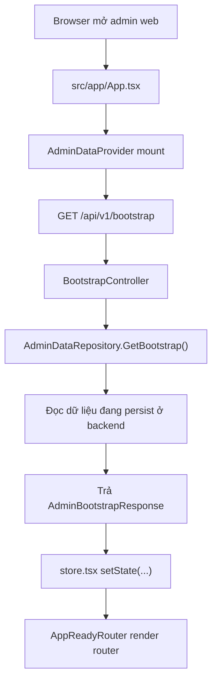
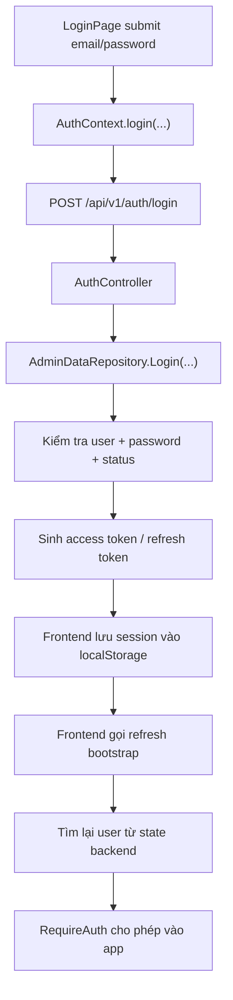
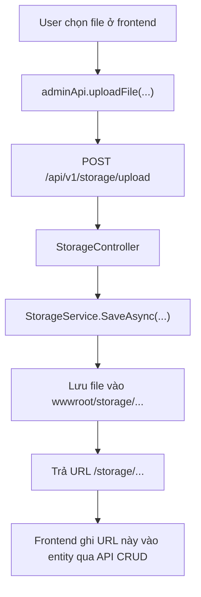

# Luồng hệ thống

## 1. Tổng quan hiện tại

Hệ thống hiện tại đã được thống nhất theo một luồng dữ liệu duy nhất:

- frontend admin khởi động bằng `GET /api/v1/bootstrap`
- đăng nhập admin đi qua `POST /api/v1/auth/login`
- các màn quản trị không còn lưu dữ liệu vận hành bằng `localStorage`
- mọi thao tác `save*` ở frontend đã trở thành lệnh gọi API CRUD tương ứng
- upload ảnh/audio/QR đi qua backend storage thật, sau đó frontend chỉ lưu URL trả về
- backend là nguồn dữ liệu duy nhất cho toàn bộ admin state

Điểm còn cần lưu ý:

- backend hiện vẫn persist dữ liệu về file seed SQL qua `AdminDataRepository`, chưa phải database quan hệ chạy thật
- frontend vẫn dùng `localStorage`, nhưng chỉ để giữ session đăng nhập admin

## 2. Luồng khởi động



Chi tiết:

1. `src/app/App.tsx` bọc toàn bộ ứng dụng bằng `AdminDataProvider` và `AuthProvider`.
2. `src/data/store.tsx` gọi `adminApi.getBootstrap()` ngay khi provider mount.
3. `src/lib/api.ts` gửi request `GET /api/v1/bootstrap`.
4. `apps/backend-api/Controllers/BootstrapController.cs` trả toàn bộ bootstrap data.
5. `apps/backend-api/Infrastructure/AdminDataRepository.cs` đọc dữ liệu backend hiện tại.
6. `state` của frontend được nạp từ response bootstrap.
7. `AppReadyRouter` chỉ cho router render sau khi bootstrap xong.

Kết luận:

- frontend không còn hydrate state vận hành từ `seed.ts`
- frontend không còn dùng `localStorage` làm admin source of truth

## 3. Luồng đăng nhập



Chi tiết:

1. `src/features/auth/LoginPage.tsx` gọi `useAuth().login(...)`.
2. `src/features/auth/AuthContext.tsx` gọi `adminApi.login(...)`.
3. Backend nhận request tại `apps/backend-api/Controllers/AuthController.cs`.
4. `AdminDataRepository.Login(...)` kiểm tra tài khoản admin đang active.
5. Backend trả `AuthTokensResponse`.
6. Frontend lưu `userId`, `accessToken`, `refreshToken`, `expiresAt` vào `localStorage`.
7. Frontend gọi lại `refreshData()` để bootstrap state mới nhất từ backend.
8. `AuthContext` map `session.userId` về `state.users` và dựng `user` hiện tại.

Lưu ý:

- session admin vẫn ở `localStorage`
- dữ liệu user/profile hiển thị trên app vẫn lấy từ bootstrap backend

## 4. Luồng CRUD các màn quản trị

Tất cả các màn vẫn gọi `useAdminData()`, nhưng `save*` trong `src/data/store.tsx` giờ chỉ làm 2 việc:

1. gọi API CRUD tương ứng ở backend
2. gọi `refreshData()` để đồng bộ lại state từ `GET /api/v1/bootstrap`

### 4.1 Places

Luồng:

- `src/features/places/PlacesPage.tsx`
- `savePlace(...)` trong `src/data/store.tsx`
- `POST /api/v1/places` hoặc `PUT /api/v1/places/{id}`
- `POST /api/v1/translations` hoặc `PUT /api/v1/translations/{id}`
- `refreshData()`

Ý nghĩa:

- place và translation mặc định đều được lưu qua backend
- QR code cho place được backend cập nhật trong repository

### 4.2 Users

Luồng:

- `src/features/users/UsersPage.tsx`
- `saveUser(...)`
- `POST /api/v1/users` hoặc `PUT /api/v1/users/{id}`
- `refreshData()`

### 4.3 Promotions

Luồng:

- `src/features/promotions/PromotionsPage.tsx`
- `savePromotion(...)`
- `POST /api/v1/promotions` hoặc `PUT /api/v1/promotions/{id}`
- `refreshData()`

### 4.4 Reviews

Luồng:

- `src/features/reviews/ReviewsPage.tsx`
- `saveReviewStatus(...)`
- `PATCH /api/v1/reviews/{id}/status`
- `refreshData()`

### 4.5 Settings

Luồng:

- `src/features/settings/SettingsPage.tsx`
- `saveSettings(...)`
- `PUT /api/v1/settings`
- `refreshData()`

Nút "Tải lại từ backend" chỉ gọi lại bootstrap, không reset dữ liệu local demo nữa.

### 4.6 Food content

Luồng:

- `src/features/content/ContentPage.tsx`
- upload ảnh qua `POST /api/v1/storage/upload`
- nhận URL `/storage/...`
- `saveFoodItem(...)`
- `POST /api/v1/food-items` hoặc `PUT /api/v1/food-items/{id}`
- `refreshData()`

### 4.7 Audio & narration

Luồng:

- `src/features/media/MediaPage.tsx`
- nếu source là uploaded:
  - upload MP3 qua `POST /api/v1/storage/upload`
  - nhận URL `/storage/audio/guides/...`
- `saveAudioGuide(...)`
- `saveTranslation(...)`
- `refreshData()`

### 4.8 QR

Luồng:

- `src/features/qr/QrRoutesPage.tsx`
- upload ảnh QR qua `POST /api/v1/storage/upload`
- nhận URL `/storage/images/qr-codes/...`
- `PATCH /api/v1/qr-codes/{id}/image`
- hoặc `PATCH /api/v1/qr-codes/{id}/state`
- `refreshData()`

## 5. Luồng upload thật qua backend storage



Các đường upload đang dùng:

- `images/food-items`
- `audio/guides`
- `images/qr-codes`

Backend phục vụ file tĩnh qua:

- `app.UseStaticFiles()` trong `apps/backend-api/Program.cs`

## 6. Nguồn dữ liệu duy nhất

Luồng dữ liệu hiện tại:

```text
UI -> useAdminData() -> adminApi -> backend controllers -> AdminDataRepository -> persisted backend state
UI <- useAdminData().refreshData() <- GET /api/v1/bootstrap <- backend
```

Điều này có nghĩa:

- frontend không tự quyết định state vận hành lâu dài
- frontend không tự persist `places`, `users`, `promotions`, `reviews`, `settings`, `foodItems`, `audioGuides`, `qrCodes` vào trình duyệt
- backend là nơi quyết định dữ liệu chuẩn

## 7. Các file chính liên quan đến luồng

Frontend:

- `apps/admin-web/src/app/App.tsx`
- `apps/admin-web/src/data/store.tsx`
- `apps/admin-web/src/lib/api.ts`
- `apps/admin-web/src/features/auth/AuthContext.tsx`
- `apps/admin-web/src/features/auth/LoginPage.tsx`
- `apps/admin-web/src/features/places/PlacesPage.tsx`
- `apps/admin-web/src/features/content/ContentPage.tsx`
- `apps/admin-web/src/features/media/MediaPage.tsx`
- `apps/admin-web/src/features/qr/QrRoutesPage.tsx`
- `apps/admin-web/src/features/reviews/ReviewsPage.tsx`
- `apps/admin-web/src/features/settings/SettingsPage.tsx`
- `apps/admin-web/src/features/users/UsersPage.tsx`
- `apps/admin-web/src/features/promotions/PromotionsPage.tsx`
- `apps/admin-web/src/components/ui/ImageSourceField.tsx`
- `apps/admin-web/vite.config.ts`

Backend:

- `apps/backend-api/Program.cs`
- `apps/backend-api/Contracts/ApiResponse.cs`
- `apps/backend-api/Controllers/BootstrapController.cs`
- `apps/backend-api/Controllers/AuthController.cs`
- `apps/backend-api/Controllers/PlacesController.cs`
- `apps/backend-api/Controllers/UsersController.cs`
- `apps/backend-api/Controllers/PromotionsController.cs`
- `apps/backend-api/Controllers/ReviewsController.cs`
- `apps/backend-api/Controllers/SettingsController.cs`
- `apps/backend-api/Controllers/FoodItemsController.cs`
- `apps/backend-api/Controllers/AudioGuidesController.cs`
- `apps/backend-api/Controllers/TranslationsController.cs`
- `apps/backend-api/Controllers/QrRoutesController.cs`
- `apps/backend-api/Controllers/StorageController.cs`
- `apps/backend-api/Infrastructure/AdminDataRepository.cs`
- `apps/backend-api/Infrastructure/StorageService.cs`

## 8. Lưu ý khi phát triển tiếp

1. Muốn thêm một màn CRUD mới, nên thêm endpoint backend trước, rồi mới thêm `save*` tương ứng trong `store.tsx`.
2. Nếu có file upload mới, nên đi qua `POST /api/v1/storage/upload`, không đọc file thành `data:` URL rồi nhét vào state.
3. Nếu backend đổi schema bootstrap, cần cập nhật `src/data/types.ts` và `src/lib/api.ts`.
4. Nếu chuyển từ seed SQL sang DB thật, nên giữ nguyên contract bootstrap/auth/CRUD để frontend không phải đổi nhiều.

## 9. Tóm tắt một câu

Luồng hiện tại là: frontend khởi động bằng bootstrap từ backend, đăng nhập qua auth API, mọi màn quản trị ghi dữ liệu qua CRUD API, file upload đi qua backend storage, và backend là nguồn dữ liệu duy nhất của admin web.
