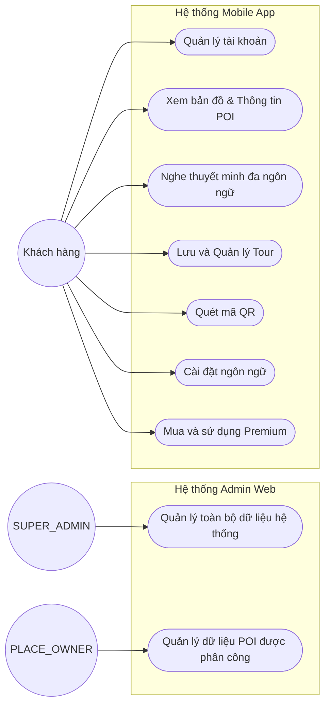

# Sơ đồ Use Case Hệ thống Vinh Khanh Food

Dựa trên tài liệu hệ thống (`README.md`), đây là sơ đồ Use Case cho hệ thống, với các tác nhân (Actors) chính và các trường hợp sử dụng (Use Cases) tương ứng.

## Danh sách Tác nhân (Actors) và Use Cases

1. **SUPER_ADMIN** (Quản trị viên cấp cao)
   - Hoạt động trên: Admin web
   - Quyền hạn: Quản lý toàn bộ dữ liệu hệ thống (Quản trị nội dung, POI, tour, media, thuyết minh, người dùng, đánh giá, khuyến mãi, cấu hình...).

2. **PLACE_OWNER** (Chủ quán/Địa điểm)
   - Hoạt động trên: Admin web
   - Quyền hạn: Quản lý dữ liệu của POI/quán được phân công.

3. **Khách hàng** (Customer)
   - Hoạt động trên: Mobile app
   - Các chức năng chính:
     - Xem bản đồ.
     - Xem thông tin POI.
     - Nghe/xem thuyết minh về địa điểm.
     - Quản lý Tour cá nhân (My Tour).
     - Quét mã QR.
     - Quản lý tài khoản (Đăng ký, đăng nhập, cập nhật hồ sơ).
     - Đổi ngôn ngữ hiển thị.
     - Mua và sử dụng các tính năng Premium.

## Sơ đồ Use Case (Mermaid)

